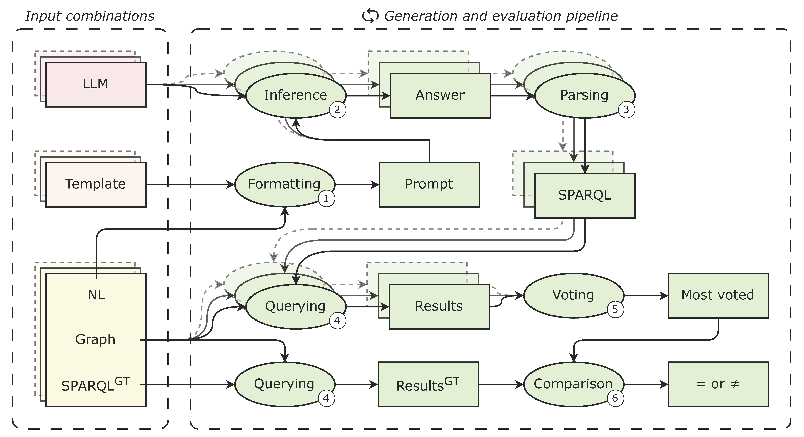
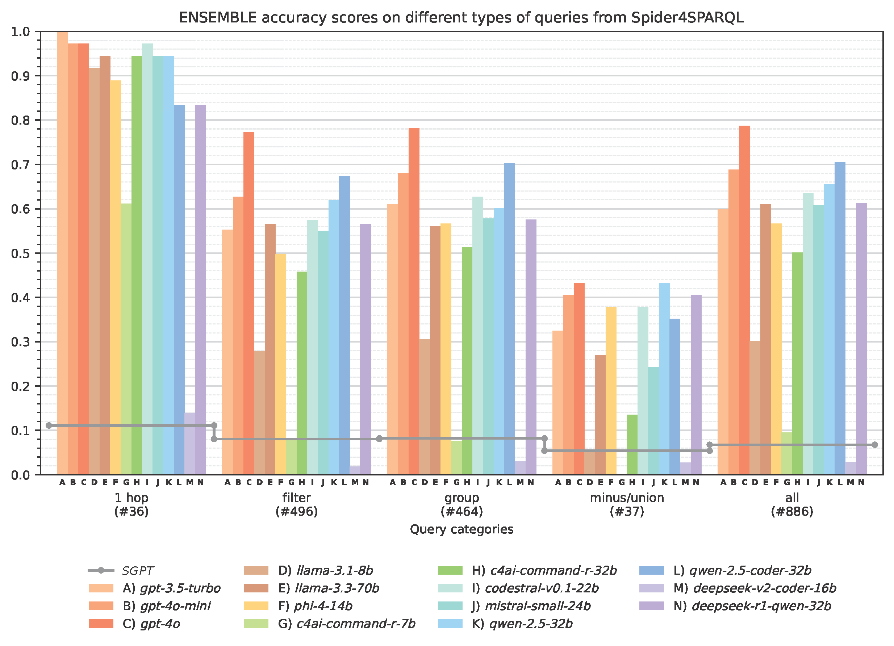

# LLMs-for-SPARQL
This repository contains the code and datasets for our study, [***Are LLMs adequate SPARQL query generators?
Investigating Zero-Shot NL-to-SPARQL translation***](https://link.springer.com/article/10.1007/s00521-025-11799-x). The project evaluates the capability of Large Language Models
(LLMs) to generate SPARQL queries from natural language (NL) questions in a zero-shot setting.

## Overview
We **test multiple LLMs on diverse knowledge graphs with different ontologies: given an NL question and ontology data,
the LLM models generate SPARQL queries, which are then executed and compared against ground truth queries to assess
their accuracy**. Our evaluation explores:
- The impact of ontology context on query generation
- The performance of different prompt templates
- How model size affects query correctness and complexity handling

This repository provides the **full experimental pipeline**, including:
- Datasets (NL questions, SPARQL queries, ontologies)
- LLM inference scripts for query generation
- Evaluation measures for result comparison

The diagram below outlines the experimental pipeline, highlighting the key steps from query generation to evaluation.  


## Datasets
We use three datasets for evaluating NL-to-SPARQL translation:
- **[Spider4SPARQL](https://github.com/ckosten/Spider4SPARQL/)**  
- **[Bestiary](https://github.com/danrd/sparqlgen/tree/main)**  
- **[LC-QuAD](https://github.com/AskNowQA/LC-QuAD)**  

Unlike many NL-to-SPARQL datasets tied to large, widely used KGs (e.g., DBpedia, Wikidata), *Spider4SPARQL* and *Bestiary*
are built on **custom, less popular knowledge graphs**, making them well suited for **zero-shot** evaluation.  
We additionally include *LC-QuAD* to assess model robustness under a widely adopted KG (DBpedia) and more realistic, less curated conditions, after applying a light restructuring to keep ontology size manageable.

### Why these datasets?
1. **Diversity** – They span distinct domains, topics, and query structures.  
2. **Reduced model bias** – *Spider4SPARQL* and *Bestiary* are based on KGs unlikely to have been seen during LLM training.  
3. **Practicality** – Their small ontologies (and the restructured *LC-QuAD* version) can be included entirely in prompts without retrieval or filtering.

### Dataset structure
The datasets are stored in the **`datasets/`** directory:  
- **`datasets/bestiary/`**  
- **`datasets/spider4sparql/`**  
- **`datasets/lcquad/`**  
  - **`processed/`** – Enhanced versions of the datasets  
  - **`raw/`** – Original datasets (to be downloaded separately)  
  - **`scripts/`** – Code and README files describing modifications  

### Raw datasets
The original datasets are too large for GitHub and are available on **[Zenodo](https://zenodo.org/records/14978788)**.  
The archive mirrors the **`datasets/`** structure, with the **`raw/`** folders containing unmodified data.

### Dataset modifications
We applied ontology refinements and structural adjustments for clarity and RDF compliance:
- **Spider4SPARQL** – Added domain axioms and renamed ambiguous classes/properties.  
- **Bestiary** – Added predicates (e.g., `beast_category`) to replace URI-derived information.  
- **LC-QuAD** – Restructured for compactness and to align with zero-shot assumptions.  

Details can be found in each dataset’s `scripts/` README:
- [Spider4SPARQL - preprocessing](datasets/spider4sparql/scripts/preprocessing/README.md)  
- [Spider4SPARQL - ontology refinement](datasets/spider4sparql/scripts/onto_refinement/README.md)  
- [Bestiary - enhancement](datasets/bestiary/scripts/README.md)  
- [LC-QuAD - restructuring](datasets/lcquad/scripts/README.md)  

## SGPT baseline
We used **[SGPT](https://github.com/rashad101/SGPT-SPARQL-query-generation/tree/main)** as a baseline for comparison.  
SGPT is a tool for SPARQL query generation from NL, originally trained and tested on datasets like *LC-QUAD2*, *QALD9*, and *VQUANDA*.  
Since ***Bestiary* has no training set**, we only ran SGPT on *Spider4SPARQL*. We adapted its code for compatibility with the dataset’s training/dev splits.

The modified SGPT code is not included here. Download it, along with the *Spider4SPARQL* model, from **[Zenodo](https://zenodo.org/records/14978788)** and place it in `sgpt/`.

## Source folder
The **`src/`** folder contains several utility modules and frameworks used in our experiments:
- **`llms/`** – custom framework for invoking multiple LLMs  
- **`logger`** – logging utility for tracking/debugging  
- **`jena.py`** – Python interface to run SPARQL queries on RDF KGs using Jena  
- **`dbpedia.py`** – interface for running SPARQL queries on the DBpedia endpoint  
- **`timeout.py`** – functions for running code with a maximum execution time

## Experiments
The **`experiments/`** folder contains the code to replicate our experiments and the results:  

- **`agents/`** – code to run the LLMs on the query generation task.  
  - `basic.py` – template with simple instructions  
  - `detailed.py` – template with detailed task description
  - `cot.py` – template of chain-of-thought approach  
- **`evaluation/`** – evaluation scores, measures, and comparison criteria  
- **`logs/`** and **`runs/`** – LLM outputs and process logs

Key scripts:  
- **`run_ground_truth.py`** – executes all ground truth queries  
- **`run_sgpt_processing.py`** – processes SGPT output into our evaluation format  
- **`run_llm_generation.py`** – runs an LLM over all datasets and prompt templates  
- **`run_evaluation.py`** – compares generated queries against ground truth and computes metrics (accuracy, time, syntax correctness, determinism, etc.)

### Results
Below is a preview of the accuracies obtained by the tested LLMs:  


Detailed explanations and comments are in the paper. Full results are in **`experiments/evaluation/scores/`**.

### How to Run
Requires **Python 3.12**. Install dependencies with:
```bash
pip install -r requirements.txt
````

We used `transformers==4.48.1` for most experiments, but downgraded to `4.47.0` for `deepseek-ai/DeepSeek-Coder-V2-Lite-Instruct`.

Ensure `src` is in your `PYTHONPATH`. Run scripts from their folders:

```bash
python run_ground_truth.py
```

**Note:** `matplotlib` is required for evaluation, but installing it in the same environment as generation may break dependencies (e.g., via `numpy` changes).
Consider using a separate environment for evaluation.

### Requirements to run SPARQL queries

* **Jena** – for `jena.py`, install [Apache Jena](https://jena.apache.org/download/index.cgi) and set `JENA_HOME`
* **DBpedia access** – for `dbpedia.py`, ensure internet access to the DBpedia endpoint

### Notes about datasets
To run scripts in **`datasets/`**, download the raw datasets from **[Zenodo](https://zenodo.org/records/14978788)** and place them in the correct directories.

## Cite this work
If you find [this work](https://link.springer.com/article/10.1007/s00521-025-11799-x) useful, please cite:
```bib
@article{giuliani_are_2026,
	title = {Are {LLMs} adequate {SPARQL} query generators? {Investigating} zero-shot {NL}-to-{SPARQL} translation},
	volume = {38},
	issn = {1433-3058},
	url = {https://doi.org/10.1007/s00521-025-11799-x},
	doi = {10.1007/s00521-025-11799-x},
	number = {3},
	journal = {Neural Computing and Applications},
	author = {Giuliani, Alessandro and Manca, Marco Manolo and Piano, Leonardo and Podda, Alessandro Sebastian and Pompianu, Livio and Tiddia, Sandro Gabriele},
	month = feb,
	year = {2026},
	pages = {33},
}
```
